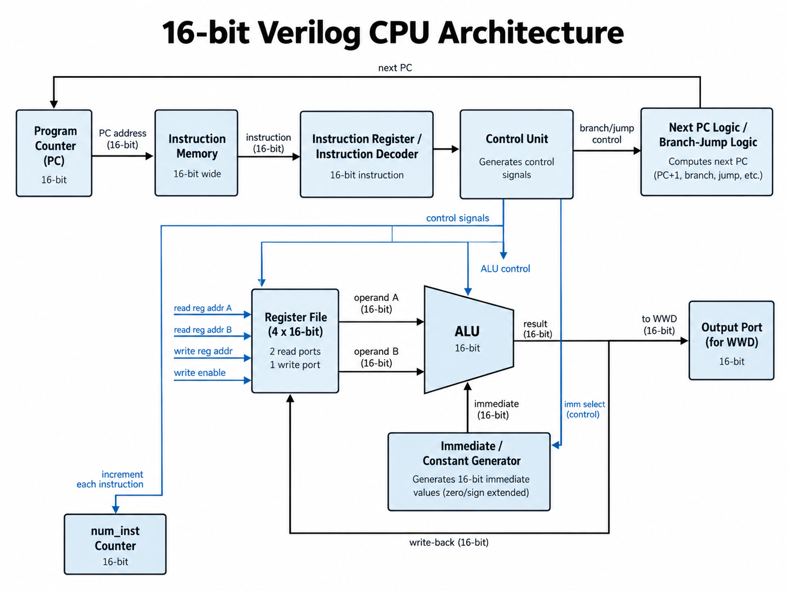
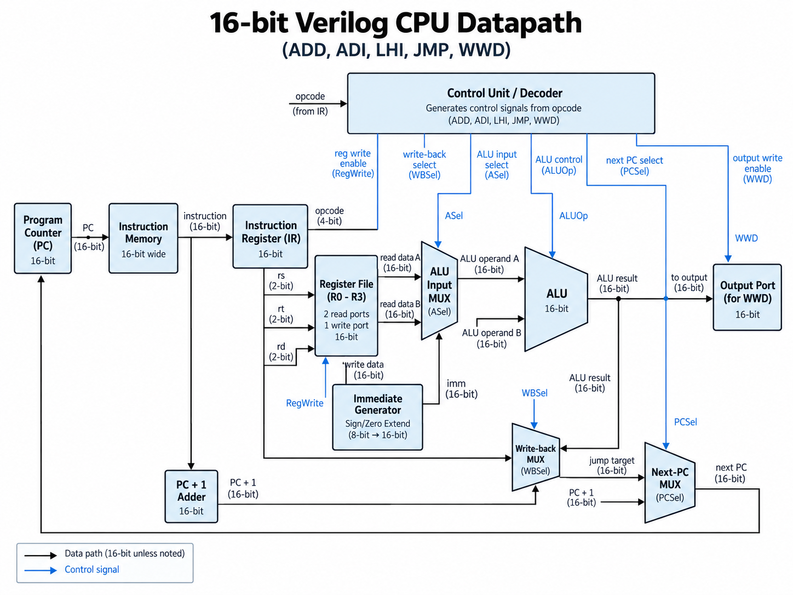

# 16-bit Verilog CPU

A 16-bit educational CPU implemented in Verilog.

The project contains a CPU core, a standalone 16-operation ALU,
and a 4-entry register file developed while studying computer
architecture.

## Architecture

## Datapath

## CPU Features

- 16-bit datapath
- 4 general-purpose 16-bit registers
- Program Counter
- Instruction decoding
- Sign-extended immediate operations
- Jump control
- Output port for WWD
- Instruction counter

## Supported CPU Instructions

| Instruction | Description |
|---|---|
| ADD | Register-register addition |
| ADI | Register-immediate addition |
| LHI | Load high immediate |
| JMP | Unconditional jump |
| WWD | Write register value to output port |

## Standalone ALU Operations

The standalone ALU implements 16 operations:

ADD, SUB, ID, NAND, NOR, XNOR, NOT, AND,
OR, XOR, LRS, ARS, RR, LLS, ALS, and RL.

## Register File

The standalone register file contains four 16-bit registers.

- Two asynchronous read ports
- One synchronous write port
- Synchronous reset

## Project Structure

src/
- cpu.v
- ALU.v
- RF.v

docs/
- architecture.png
- datapath.png

tests/
- Verilog testbenches

## Implementation Note

The standalone ALU and Register File were implemented as individual
hardware components in an earlier stage of the project.

The final CPU core implements the required register file, arithmetic,
instruction decoding, and control logic directly inside `cpu.v`.

## Tools

- Verilog HDL
- Digital logic simulation
- Git / GitHub
